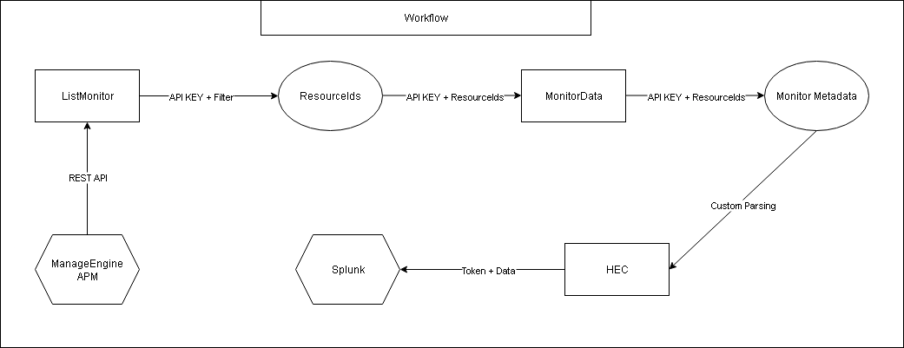

# ManageEngine APM → Splunk HEC Forwarder

A Python script that retrieves monitor data from **ManageEngine Application Manager (APM)** and forwards it to **Splunk HTTP Event Collector (HEC)**.  

The script is designed to run as a **Splunk custom script** in the data input section, automatically executing at a user-defined interval configured in Splunk.

## Workflow



## Features

- Fetches monitor list from ManageEngine APM via REST API (XML)
- Filters monitors based on attribute values (e.g., availability)
- Retrieves detailed data for monitors and their child monitors
- Sends structured events to Splunk via HEC
- Executes automatically based on Splunk data input interval
- Includes logging for visibility and troubleshooting
- Supports configuration via script constants or environment variables

## Requirements

- Python **3.7+**
- Splunk instance with HTTP Event Collector (HEC) enabled and a valid token
- ManageEngine APM server with API access enabled
- Splunk instance configured to support custom script data inputs

## Installation

1. **Clone the repository**
    ```bash
    git clone https://github.com/TuanCui22/ManageEngine-APM-to-Splunk-HEC-Forwarder.git
    cd ManageEngine-APM-to-Splunk-HEC-Forwarder
    ```

2. **Install dependencies**
    ```bash
    pip install -r requirements.txt
    ```

3. **Configure settings**
    Update the script with your configuration details, either directly in the script or via environment variables:
    ```python
    APM_SERVER = "http://<apm-server>:9090"
    API_KEY = "<your-apm-api-key>"
    SPLUNK_HEC_URL = "https://<splunk-server>:8088/services/collector"
    SPLUNK_HEC_TOKEN = "<your-splunk-hec-token>"
    SPLUNK_INDEX = "<splunk-index>"
    ```

4. **Set up Splunk custom script**
    - Copy the script (`apm_to_splunk.py`) to the Splunk `bin` directory (e.g., `$SPLUNK_HOME/bin/scripts/`).
    - Configure a new scripted input in Splunk:
      1. Navigate to **Settings > Data Inputs > Scripts** in the Splunk UI.
      2. Select the script path and set the execution interval (e.g., `60` for every 60 seconds).
      3. Specify the target index (e.g., `me-apm`) and any additional settings.
    - Ensure the Splunk user has execution permissions for the script.

## Usage

### Running as a Splunk scripted input
Once configured in Splunk, the script runs automatically based on the interval defined in the Splunk data input settings. No manual execution is required.

### Environment variables (optional)
You can use environment variables to override script constants:
```bash
export APM_SERVER="http://apm-server:9090"
export API_KEY="your-apm-api-key"
export SPLUNK_HEC_URL="https://splunk-server:8088/services/collector"
export SPLUNK_HEC_TOKEN="your-token"
export SPLUNK_INDEX="me-apm"
```

### Example log output
Logs are written to Splunk or the script's configured log file for troubleshooting:
```
[INFO] Fetching list of monitors...
[INFO] After filtering, found 3 monitors:
[INFO] RESOURCEID: 101, DISPLAYNAME: WebServer-1, HOSTIP: 192.168.1.10
[INFO] Fetching monitor data for RESOURCEID: 101
[INFO] Successfully sent event to Splunk HEC!
```

### Example Splunk event
```json
{
  "AVAILABILITYSEVERITY": "-",
  "Attributes": {
    "CPU Utilization (%)": 0,
    "I/O Wait Time (%)": 0,
    "Idle Time (%)": 100,
    "Steal Time (%)": 0,
    "System Time (%)": 0,
    "User Time (%)": 0
  },
  "DISPLAYNAME": "CPU Core-CPU_0",
  "HEALTHSEVERITY": "-",
  "RESOURCEID": 10000283,
  "host": "192.168.33.46",
  "source": "CPU Core-CPU_0"
}
```

## Notes
- Verify connectivity to the Splunk HEC endpoint and ManageEngine APM server.
- Test the script in a non-production environment before enabling it in Splunk.
- Monitor Splunk logs for errors related to script execution.

## Disclaimer
This script is provided as is, without warranty.  
Always test in a non-production environment before deploying to production.

## License
MIT License

## Author
Thanh Tuan  
GitHub: https://github.com/TuanCui22
